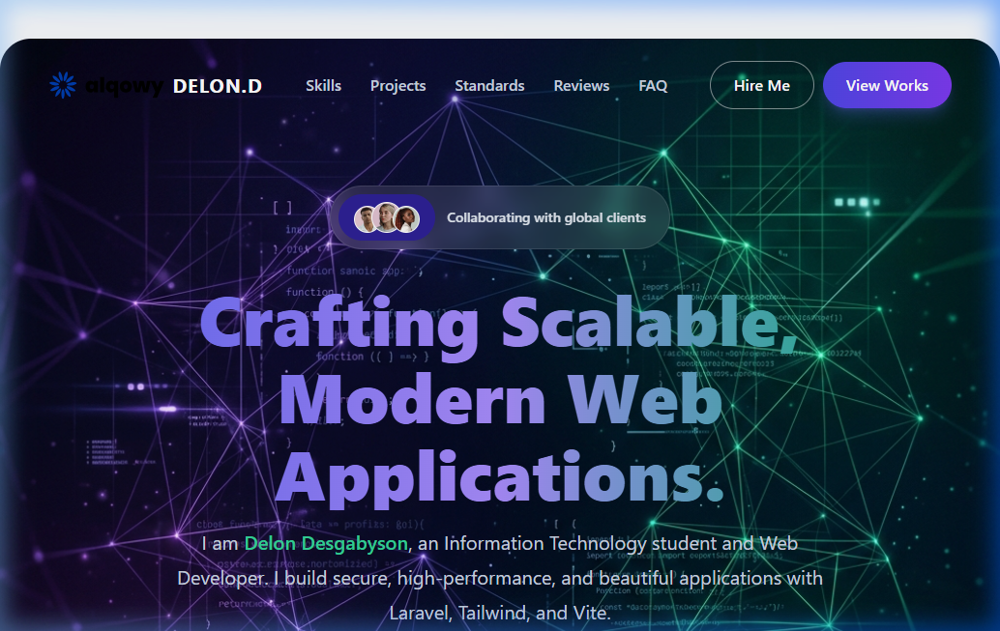

# Portofolio Laravel - Delon Desgabyson Habibie

## Identitas Pemilik
* **Nama**: Delon Desgabyson Habibie
* **NIM**: 23071018
* **Program Studi**: Sistem Informasi
* **Tujuan**: Makeover Halaman Portofolio Profesional (Tugas Kuliah / Portofolio Mandiri)

---

## Tema Portofolio
**Sistem Informasi & Rekayasa Web Full-Stack (Dark luxury Emerald & Teal Theme)**  
Sebuah portofolio interaktif dan modern yang dirancang khusus untuk memamerkan keahlian pengembangan aplikasi web, standar penulisan kode bersih (*Clean Code*), arsitektur basis data, dan implementasi deployment.

---

## Screenshot Halaman Web
Berikut adalah tampilan halaman depan (Front Page) portofolio setelah dilakukan makeover total:



---

## Teknologi yang Digunakan
Proyek ini dibangun menggunakan teknologi modern berikut:
1. **Laravel 11** - Sebagai framework PHP backend yang tangguh untuk penanganan routing, controller, arsitektur MVC, dan keamanan.
2. **Tailwind CSS v3** - Framework utility-first CSS untuk kustomisasi visual total, sistem grid responsif, animasi, serta palet warna kustom mewah (**Emerald, Teal, & Dark Slate**).
3. **Vite** - Sebagai frontend bundler yang cepat untuk mempercepat reload asset dan manajemen dependencies.
4. **Flickity** - Library slider/carousel responsif yang digunakan pada bagian *Showcase Proyek* (proyek unggulan).

---

## Fitur Utama Portofolio
* **Responsive Glassmorphism Navigation**: Menu navigasi mengambang transparan (efek glassmorphism) yang responsif dan elegan.
* **Modern Gradients Hero Banner**: Banner utama bertema gelap dengan paduan neon emerald & teal yang memikat mata dan terlihat sangat mewah.
* **Technical Skillsets Showcase**: Panel interaktif yang merinci kompetensi teknis dari rekayasa perangkat lunak hingga DevOps.
* **Flickity Project Carousel**: Slider interaktif untuk menampilkan detail proyek-proyek utama yang dikembangkan secara interaktif.
* **Marquee Testimonials**: Baris ulasan dinamis (marquee) yang bergerak otomatis menampilkan umpan balik kolaborator.
* **Interactive Accordion FAQ**: Tanya jawab interaktif yang didukung vanilla Javascript dengan transisi animasi halus.

---

## Cara Menjalankan Proyek Lokal

1. Clone repositori ini:
   ```bash
   git clone https://github.com/username/delon-desgabyson-portfolio-laravel.git
   cd delon-desgabyson-portfolio-laravel
   ```

2. Instal dependencies PHP dan Node:
   ```bash
   composer install
   npm install
   ```

3. Salin file `.env` dan generates app key:
   ```bash
   copy .env.example .env
   php artisan key:generate
   ```

4. Jalankan server lokal:
   ```bash
   php artisan serve
   ```

5. Compile/Jalankan bundler asset (Vite):
   ```bash
   npm run dev
   ```
   *Atau jika ingin mengompilasi CSS Tailwind secara mandiri:*
   ```bash
   npx tailwindcss -i ./resources/css/app.css -o ./public/css/output.css
   ```
"# Delon-Portofolio" 
